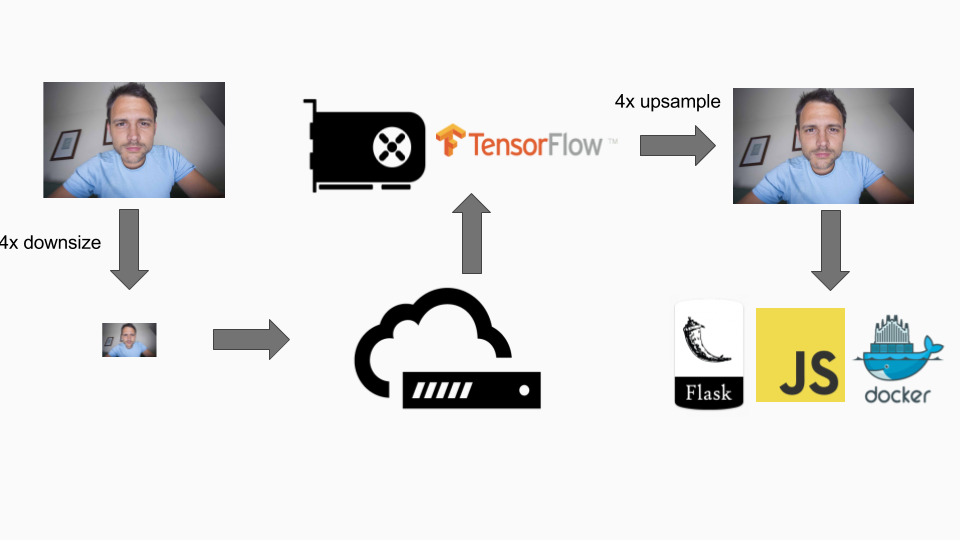

# Real-time Webcam Video Super-Resolution Demo

Code for deploying a demo of real-time webcam [video super-resolution](https://github.com/edwardjkim/enhance).
See the [Enhance](https://github.com/edwardjkim/enhance) repo for training the network.
The following figure shows the pipeline.



We use `getUserMedia` to stream the webcam video. The video is downsampled by a factor of 4x,
and the downsized frames are sent to the server for GPU processing.
Tensorflow uses the GPU to upsampled the frames, and we serve the upsampled stream
using Flask and Javascript.

## Deploying

Requires [nvidia-docker](https://github.com/NVIDIA/nvidia-docker).
Generate a self-signed certificate, and save the cert as `server.crt` and the key as `server.key`.
Run

```bash
./deploy.sh
```

To record a video with your webcam, go to

```bash
https://[localhost]/webcam
```

and you can watch a comparison of the original video (upsampled with Nearest Neighbor),
a video upsampled with bicubic interpolation, and a high-resolution video upsampled with
a generative Neural Network.
